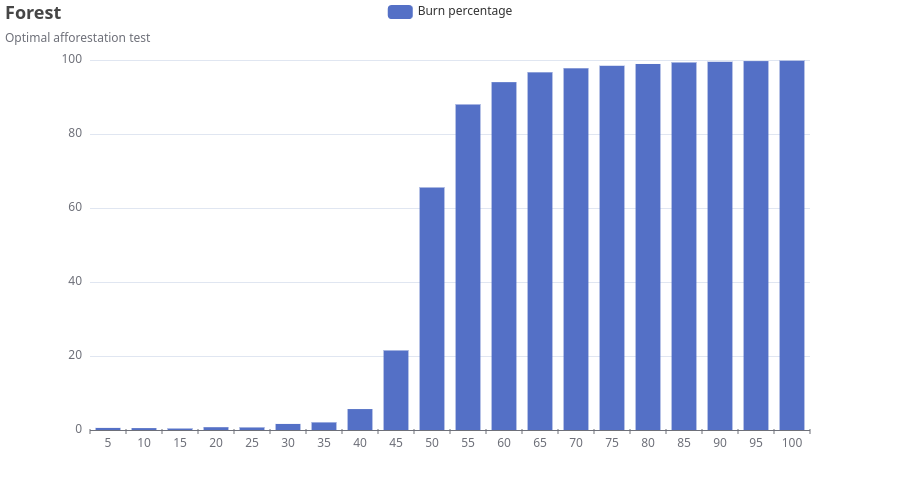

# Zadanie 2 Go

## Symulacja spalania lasu

W mojej symulacji podpalone drzewo podpala wszystkie drzewa znajdujące się po bokach i na rogach.

Przy estymacji optymalnego zalesienia wykonuję symulację po 100 razy dla zalesienia równego od 5 do 100 z odstępem 5.

Program oblicza najbardziej optymalne zalesienie poprzez znalezienie pokrycia lasu, w którym pozostało najwięcej drzew po podpaleniu.

Taki jest wynik mojej symulacji

Z tego wykresu możemy zaobserwować, że najbardziej optymalnym zalesieniem jest pokrycie między 35%, a 45%.

Pokrywa to się z obliczeniami, z których wyszło, że najbardziej optymalne zalesienie to 40%.

## Dodatkowy parametr

Do mojego rozwiązania dodałem dodatkowy parametr, którym jest wiek drzewa.
Drzewa stare (wiek > 55 lat) mają 100% szansy na bycie podpalonym przez sąsiada.
Natomiast drzewa młode (wiek < 55 lat) mają 50% szans na bycie podpalonym.

## Oznaczenia

Przy prezentacji wizualnej drzewa młode oznaczone są "🌲", natomiast drzewa stare "🌳".

Ogień jest oznaczony poprzez symbol "🔥", natomiast miejsce uderzenia pioruna "🌩️".
